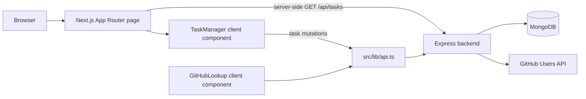

# Task Manager Frontend

The frontend is a single-page task management interface built with Next.js App Router. It renders the initial task list on the server, hydrates an interactive client-side task manager, and includes a GitHub profile lookup backed by the companion Express API.

## Features

- Create tasks with a required title and optional description.
- Edit task titles and descriptions inline.
- Mark tasks complete or incomplete.
- Delete tasks and update the local list immediately after successful requests.
- Separate pending and completed tasks and display completion totals.
- Look up public GitHub profiles by username.
- Display loading, empty, validation, and API error states.
- Adapt the layout for narrow and wide screens.
- Follow the operating system's light or dark color preference.

## Tech Stack

| Area                  | Implementation                                             |
| --------------------- | ---------------------------------------------------------- |
| Framework and routing | Next.js 16 App Router                                      |
| UI runtime            | React 19                                                   |
| Language              | TypeScript with strict type checking                       |
| Styling               | Tailwind CSS 4 through PostCSS                             |
| State management      | Local React `useState` state                               |
| Forms                 | Controlled React inputs                                    |
| Validation            | Client-side title trimming and required-field check        |
| API layer             | Typed wrappers around the native Fetch API                 |
| Images                | Next.js `Image` with GitHub avatar host allowlisting       |
| Fonts                 | Geist and Geist Mono through `next/font`                   |
| Linting               | ESLint 9 with Next.js Core Web Vitals and TypeScript rules |
| Build tool            | Next.js with Turbopack                                     |
| Package manager       | npm (`package-lock.json`)                                  |

There is no external state-management, form, validation, component, chart, table, rich-text, upload, or authentication library in this application. No frontend test script or test suite is currently configured.

## Project Structure

```text
frontend/
├── src/
│   ├── app/
│   │   ├── favicon.ico
│   │   ├── globals.css       # Tailwind import, theme variables, dark mode
│   │   ├── layout.tsx        # Root layout, metadata, and fonts
│   │   └── page.tsx          # Server-rendered home route and initial fetch
│   ├── components/
│   │   ├── GitHubLookup.tsx  # GitHub search form and profile card
│   │   ├── TaskForm.tsx      # Shared create/edit form
│   │   ├── TaskItem.tsx      # Task actions and inline editing
│   │   ├── TaskList.tsx      # Pending/completed list grouping
│   │   └── TaskManager.tsx   # Client state and task mutations
│   ├── lib/
│   │   └── api.ts            # Backend API client
│   └── types/
│       └── index.ts          # Task and GitHub response types
├── .env.example
├── next.config.ts
├── postcss.config.mjs
├── eslint.config.mjs
├── tsconfig.json
└── package.json
```

## Installation

Run these commands from the repository root:

```bash
cd frontend
npm install
```

The backend must also be installed and running for task data and GitHub lookups to work.

## Environment Variables

Create `.env.local` from `.env.example` and set the backend API base URL:

| Variable              | Required | Description                                       | Local value                 |
| --------------------- | -------- | ------------------------------------------------- | --------------------------- |
| `NEXT_PUBLIC_API_URL` | No       | Base URL used by server and client Fetch requests | `http://localhost:5000/api` |

When the variable is absent, the code falls back to `http://localhost:5000/api`. The checked-in example contains a production-shaped Vercel backend URL.

## Running Locally

Start the backend first, then run:

```bash
npm run dev
```

The Next.js development server is available at `http://localhost:3000` by default.

## Available Scripts

| Command         | Purpose                                                        |
| --------------- | -------------------------------------------------------------- |
| `npm run dev`   | Start the Next.js development server                           |
| `npm run build` | Create an optimized production build and run TypeScript checks |
| `npm run start` | Serve an existing production build                             |
| `npm run lint`  | Run ESLint across the frontend                                 |

## Production Build and Deployment

Build and serve the application with the package scripts:

```bash
npm run build
npm run start
```

Set `NEXT_PUBLIC_API_URL` before building so browser-side code contains the correct production API URL. The repository does not contain frontend Docker, CI/CD, or provider-specific deployment configuration; deployment requires a host that supports the Next.js production server.

## API Communication

`src/lib/api.ts` centralizes requests to the backend:

| Frontend operation    | Request                 |
| --------------------- | ----------------------- |
| Load tasks            | `GET /tasks`            |
| Create a task         | `POST /tasks`           |
| Edit or toggle a task | `PUT /tasks/:id`        |
| Delete a task         | `DELETE /tasks/:id`     |
| Look up a GitHub user | `GET /github/:username` |

The base URL already includes `/api`. JSON mutation requests send `Content-Type: application/json`. Failed responses handled by `apiFetch` are surfaced as errors to the relevant client component.

The home route exports `dynamic = "force-dynamic"`, so the initial task request runs for every page render instead of being statically cached.

## Authentication

The frontend has no sign-in flow, session handling, protected routes, user roles, or authorization state. All available UI operations call public backend endpoints.

## State Management

The server-rendered page supplies `initialTasks` to `TaskManager`. After hydration, `TaskManager` owns task, submission, and error state with React `useState`. Child components receive task data and async mutation callbacks through props. GitHub lookup state is isolated in `GitHubLookup`.

## Architecture



## Responsive Design

The page uses a centered `max-w-2xl` container with mobile-first spacing. Task and profile layouts use Tailwind responsive modifiers such as `sm:px-6` and `sm:flex-row`. Text wraps within task cards, controls expose focus styles and accessible labels, and system dark mode is applied with `prefers-color-scheme` and Tailwind `dark:` variants.

## Troubleshooting

### The page shows a backend connection error

- Confirm the backend is running and MongoDB is reachable.
- Confirm `NEXT_PUBLIC_API_URL` includes the backend's `/api` prefix.
- Restart the development server after changing `.env.local`.

### Browser requests are blocked by CORS

Add the frontend origin to the backend's `ALLOWED_ORIGINS` value, or set `FRONTEND_URL` when only one origin is required.

### GitHub avatars do not render

The image configuration permits `https://avatars.githubusercontent.com`. A different avatar hostname must be added to `next.config.ts` before Next.js `Image` will load it.

## Code Review & Architecture Questions

### 1. What steps would you take to secure this web application?

I would treat the Express API as the security boundary because the Next.js client and every REST task endpoint are public. The API already validates task payloads with Joi and object IDs before Mongoose queries; I would add rate limiting, Helmet security headers, request-size limits, and stricter validation for the GitHub username route. CORS would allow only the deployed frontend origins through `ALLOWED_ORIGINS` or `FRONTEND_URL`, while recognizing that CORS is not authentication.

For multi-user use, I would add authentication and enforce task ownership in the service and repository layers. Vercel would hold `MONGODB_URI` and other server-only settings; only the intentionally public `NEXT_PUBLIC_API_URL` belongs in the frontend bundle. Production errors should omit stack traces, logs should exclude secrets, MongoDB access should use a least-privilege database user and network allowlist, and the GitHub Public API proxy should handle rate limits without exposing tokens.

### 2. How would you improve the performance of this application?

I would measure the browser, Next.js server render, Express response time, and MongoDB query time separately. The current task list is small, so React memoization or virtualization would add complexity without evidence. The first useful changes would be adding a MongoDB index that supports the newest-first task query, limiting or paginating `GET /api/tasks`, and avoiding an unconditional database connection attempt for the GitHub route.

On the frontend, I would preserve the Next.js server-rendered initial list, keep mutation state local, and use optimistic updates only with rollback on API failure. If profiling shows unnecessary renders, I would split state by task or stabilize callbacks at that point. Tailwind CSS already produces a small utility stylesheet, and Next.js `Image` handles GitHub avatars. I would also cache successful GitHub Public API responses briefly in the Express layer to reduce latency and unauthenticated rate-limit pressure, then compare production Core Web Vitals and API percentiles before and after each change.

### 3. Why is MongoDB appropriate here, and when would you choose SQL instead?

MongoDB fits this application because each task is a self-contained document with a title, description, completion flag, and Mongoose timestamps. The REST task APIs mostly create, read, update, or delete one document, so the model does not require joins or complex transactions. Mongoose adds a defined schema and validation while retaining MongoDB's document-oriented storage.

I would choose PostgreSQL or another SQL database if the product added users, teams, task assignments, labels, billing, audit records, or reports with strong relationships and cross-record consistency requirements. Foreign keys, joins, and transactional constraints would then make those invariants explicit. MongoDB can model those features, but the decision should follow query patterns and integrity requirements rather than assuming NoSQL is inherently more scalable. In the current scope, MongoDB keeps persistence simple; the GitHub profile data is fetched from the GitHub Public API and is not stored locally.

### 4. How would you deploy and operate this full-stack application?

I would deploy the Next.js frontend and Express backend as separate Vercel projects connected to their respective repositories, with MongoDB hosted by a managed provider. The frontend build receives `NEXT_PUBLIC_API_URL=https://<backend-host>/api`. The backend receives `NODE_ENV=production`, `MONGODB_URI`, and explicit CORS configuration through `ALLOWED_ORIGINS` or `FRONTEND_URL`; `PORT` remains available for non-Vercel hosts. No secret value or MongoDB URI should be committed.

After deployment, I would verify all REST task APIs and the GitHub lookup from the production browser, including CORS preflights and error paths. CI should run linting and production builds before deployment. Operationally, I would add structured request/error monitoring, uptime checks, MongoDB backups and restore tests, dependency updates, and alerts for elevated API errors or GitHub rate-limit failures. Preview deployments should use isolated configuration and must not receive production database credentials unless explicitly required.
